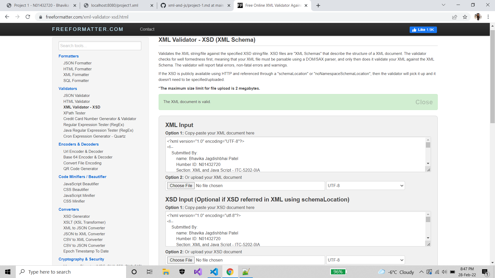

# **Project - 1**
## **Member 3:**
 - Name: Nikhil Kishor Patel
 - Humber ID: N01490223
 - Section: XML and Java Script - ITC-5202-0IA
#
## **Contribution from my side in Project 1:**
    - I created project1.xsd and half of project1.xml file

    - In "project1.xsd" file:
        - I created a xml file starting from root tag passengers having passenger element of complexType "passengerType".
        - passengerType contains the elements - ticket of complexType ticketType
                                                ,name of complexType nameType
                                                ,gender of complexType genderType
                                                ,age of complexType ageType
            and two attributes which are required - id of type xs:string,
                                                passengerClass of type xs:integer

        - ticketType contains the two attributes which are required - fare and foodIncluded

        - nameType contains the two attributes which are required  - nameId and initial

        - genderType contains the two attributes which are required  - genderId and type

        - ageType contains the two attributes which are required  - ageId and group

    - project1.xml file is created by Nikhil Patel and Manan Modi
    
    - In "project1.xml" file:
        - This file contains Ship Passenger Inventory, meaning the data of passengers travelling in the ship.
        - The root element 'passengers' contains all the passenger data.
        - There are total 45 passenger records in this file.
        - Each passenger element has 4 elements inside it : ticket, name, gender, age
                                         and 2 attributes : a unique id and passengerClass
        - ticket element has two attributes fare and foodIncluded which tells the price of ticket and whether food is included or not.
        - name element has two attributes nameId and initial which gives the unique name id and initials of name.
        - gender element has two attributes genderId and type which gives the unique gender id and type of gender.
        - age element has two attributes ageId and group which gives the unique gender id and group they belong in.

- Please refer project1.xsd and project1.xml file in my repo

 Validation : 
        