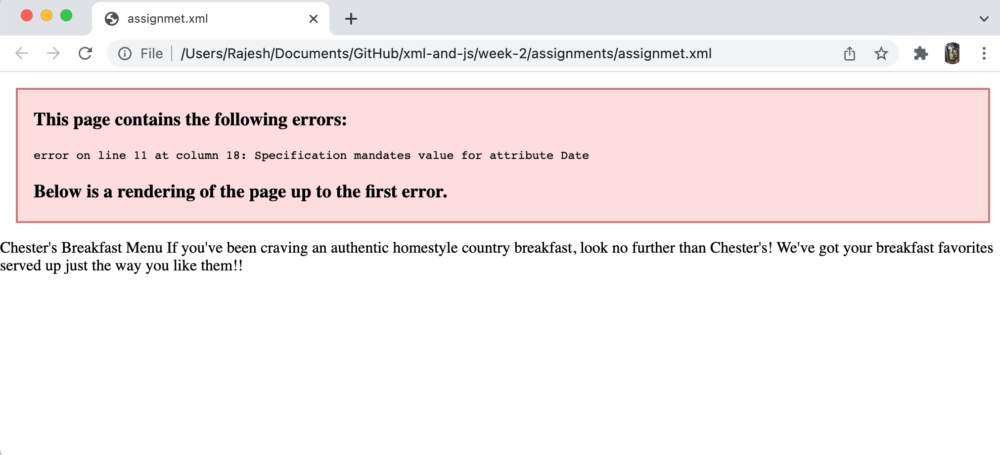
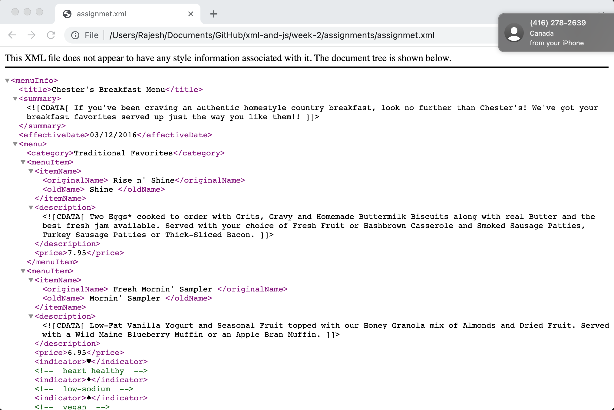
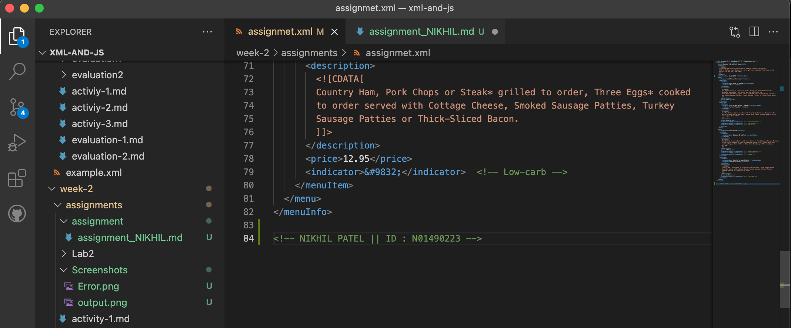
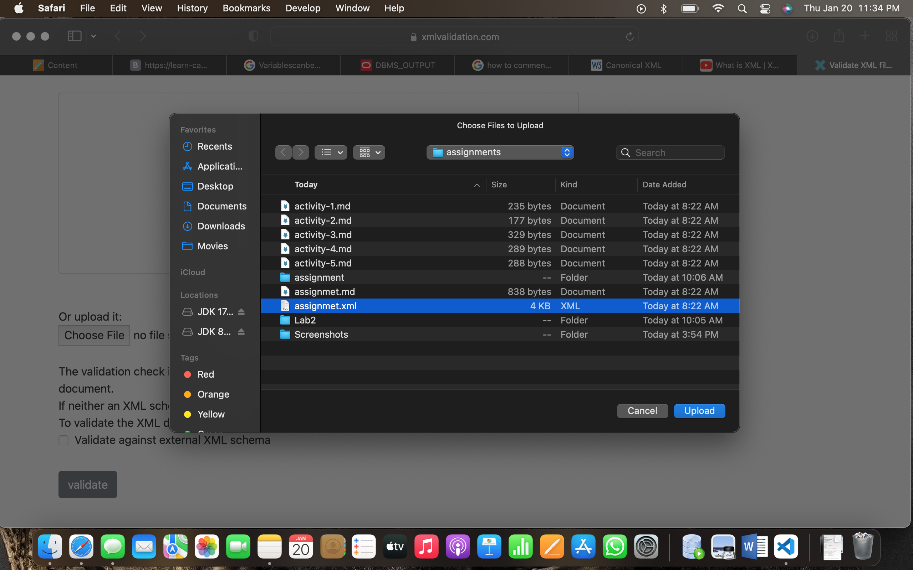
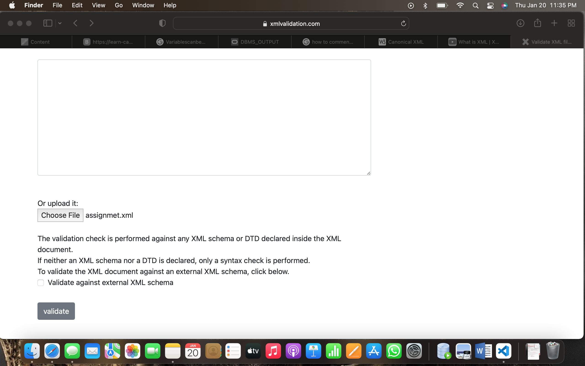
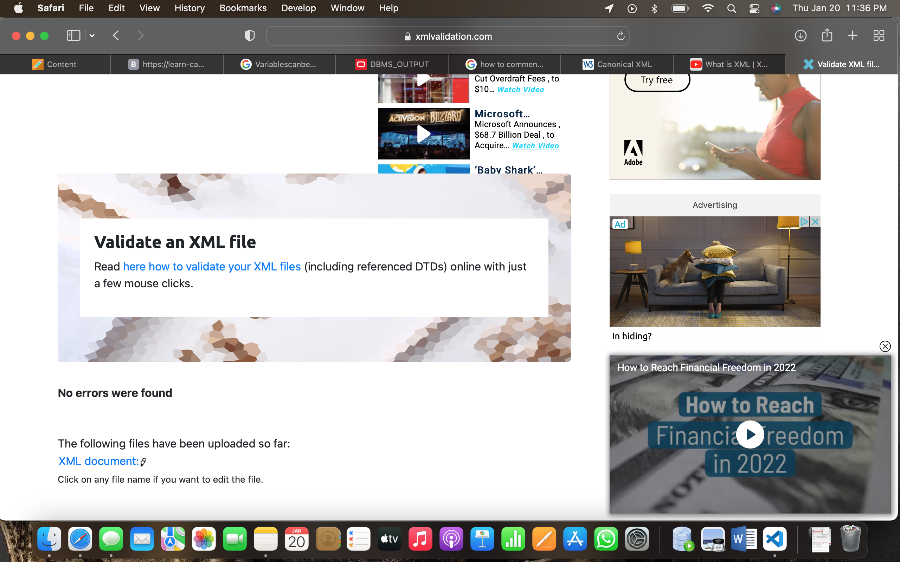

# Assignment 1

1. Open `week-2/assignments/assignment.xml` in your browser. Are there any errors? Explain the error and fix it.

Ans: 

There is one error, because there is a space between effective and Date in the <effectiveDate> element and hence Date is considered as attribute and it requires a value assigned to it.

2. What is the use of CDATA block in this document?

Ans: CDATA stands for Character Data. The data stored in this is the data that may contain reserved characters which can be interpreted as XML markup but it shouldn't be, it's treated as string data when its written inside CDATA.

3. Add comment line to the end of file which contains your name and student id.

Ans: 

4. Identify prolog, document body, and epilog in the document. Are there any processing instructions?

Ans: 
prolog - "<?xml version="1.0" encoding="UTF-8" standalone="yes" ?>"

document body - Everything starting from root element <menuInfo> till </menuInfo> is the document body

epilog - There is no epilog in the file.

5. Add inline DTD for this document.

Ans:
<!DOCTYPE menuInfo 
[
  <!ELEMENT menuInfo (title,summary,effectiveDate,menu,menu)>
  <!ELEMENT title (#PCDATA)>
  <!ELEMENT summary (#PCDATA)>
  <!ELEMENT effectiveDate (#PCDATA)>
  <!ELEMENT menu (category, menuItem, menuItem)>
  <!ELEMENT category (#PCDATA)>
  <!ELEMENT menuItem (itemName,description,price,indicator?,indicator?,indicator?)+>
  <!ELEMENT itemName (originalName,oldName?)>
  <!ELEMENT originalName (#PCDATA)> 
  <!ELEMENT oldName (#PCDATA)> 
  <!ELEMENT description (#PCDATA)> 
  <!ELEMENT price (#PCDATA)> 
  <!ELEMENT indicator (#PCDATA)> 

]>

6. Verify that file is well-formed and valid.

Ans:

7. Create `style.css` file and link it to the file. Add the following styles to the .css:

- Change font-size of `originalName`
- Display each `category` on the new line
- Add any other css-rule

Ans:
<!-- 1 -->
originalName{
    font-size: x-large;
}
<!-- 2 -->
menu{
    float: left;
}
menu:nth-child(n+1){
    clear: left;
}
<!-- 3 -->
menuInfo{
    background-color: cornsilk;
    font-family: Georgia, 'Times New Roman', Times, serif;
}
category{
    font-size: larger;
    color: crimson;
    font-style: italic;
}
title{
    font-size: xx-large;
    font-weight: bold;
}

Create `week-2/assignments/assignment_YOURNAME.md` and add your theory answers. Add screenshots of each step to the file (Refer `week-1/assignments/evaluation-1.md` on how to add image to md file)
