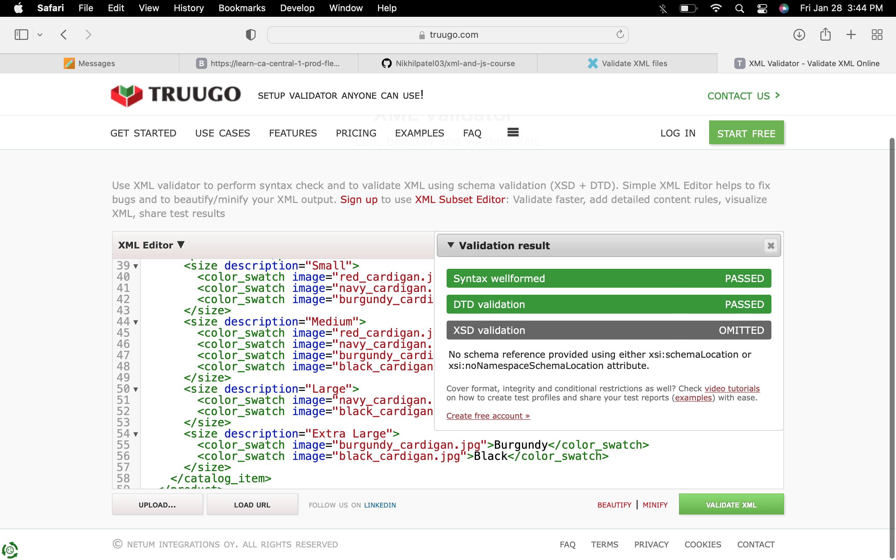
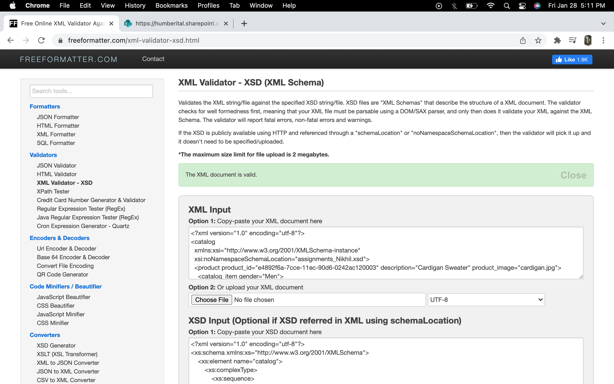

1. Open `week-3/assignments/assignment.xml` in your editor
2. Create DTD for this file and validate it using any of the tools we used

screenshot:

3. Create XSD for this file and validate it using any of the tools we used

screenshot:

4. Explain your thought process for these 2 declarations

In case of DTD the syntax is different from what we have learned so far in html, while in XSD the sysntax is just like the html tags. 

XSD is more readable and detailed but have big code while DTD is more contained and hard to understand and has smaller code.

In both the cases the process is similar i.e. we start with root element and define each element nested inside it and its attributes. One main advantage of using XSD is that it contains various elements such as XML schemas, various Datatypes, namespaces etc. which gives a better hold and flexibility while coding as compared to DTD.

