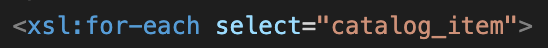

In this, firstly I created a .xsl file and then linked it to .xml file using,

In xsl file, first we need to iterate through each catalog_item present inside catalog/product in order to display the required data for it.

Then I have added product_id and description i.e the attributes of product as unordered list items.

After that there is a table for catalog_item, in which first row consists of table headers in order as mentioned in question. Second row onwards, it consists of column data for each catalog_item.

Inside each catalog_item, item number, price, gender and size columns are rendered. Inside in each size columns there is table which consists of two columns 'color' and 'image'. In that table color and image data is rendered for each size according to its description and inside that for each color_swatch.

Output:

